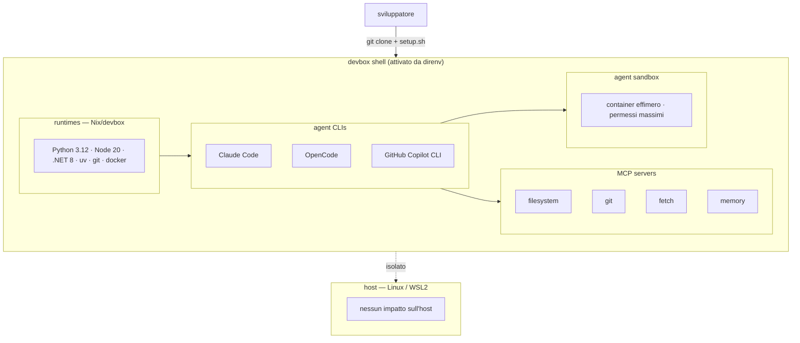

# Agent DevBox — Briefing per Claude Code

## Obiettivo

Creare un repository GitHub con un framework leggero e distribuibile che permetta a un team di sviluppatori di lavorare con agenti AI (Claude Code, GitHub Copilot CLI, OpenCode) in un ambiente isolato, riproducibile e già configurato, senza dover configurare nulla manualmente.

## Decisioni di progetto

- **Base**: Devbox (Jetify) + Nix per l'isolamento dei pacchetti
- **Attivazione automatica**: direnv + `.envrc` — il devbox shell si attiva entrando nella cartella
- **Target OS**: Linux nativo e WSL2 (stesso comportamento su entrambi)
- **Agent CLIs pre-installati**: Claude Code, GitHub Copilot CLI, OpenCode
- **Linguaggi**: Python 3.12, Node 20, .NET 8
- **MCP servers di default**: filesystem, git, fetch, memory
- **Isolamento esecuzione agenti**: container Docker effimeri con permessi massimi al loro interno

## Diagramma architettura



## Struttura del repository

```
agent-devbox/
├── devbox.json
├── devbox.lock                  # generato da devbox, non editare
├── .envrc
├── pyproject.toml
├── .gitignore
├── README.md
├── BRIEFING.md                  # questo file
├── scripts/
│   ├── setup.sh                 # bootstrap one-shot per nuovi sviluppatori
│   ├── reset.sh                 # torna a stato pulito
│   ├── sandbox.sh               # lancia agente in container isolato
│   ├── _dotnet.sh               # installa .NET dentro il devbox shell
│   └── _mcp.sh                  # genera .mcp.json con i server comuni
├── sandbox/
│   ├── Dockerfile               # immagine per eseguire gli agenti
│   └── compose.yml              # orchestrazione multi-agente
└── mcp/
    └── config.json              # configurazione MCP servers condivisa
```

## Note aperte / decisioni future

- [ ] Valutare se aggiungere MCP servers custom per il progetto specifico del team
- [ ] Decidere se pubblicare su npm come CLI installabile (`npx agent-devbox init`)
- [ ] Gestione secrets di team (Jetify Secrets vs `.env` locale)
- [ ] Aggiungere GitHub Actions per testare il setup su matrix Linux/WSL2
