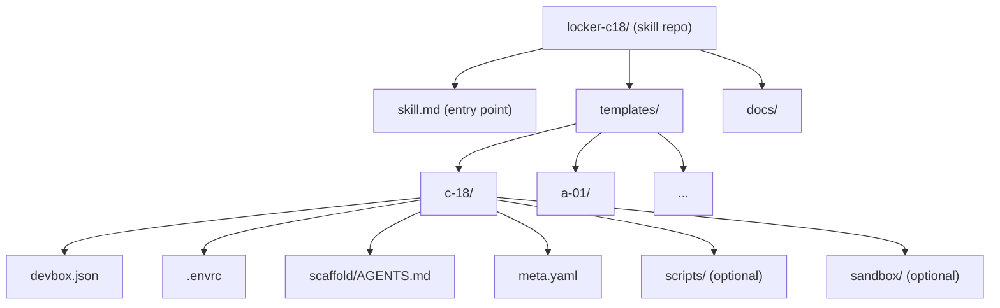
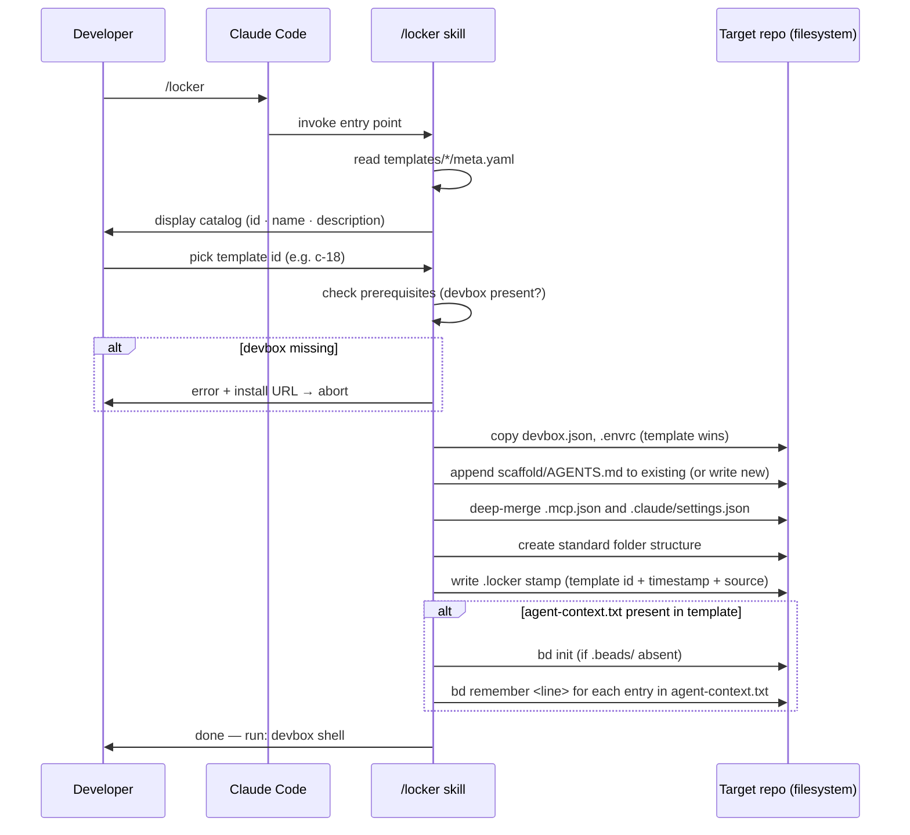

# Locker — Architecture Document

**Status**: Working draft — reflects new direction agreed with Paolo (2026-04-08).
**Supersedes**: BRIEFING.md (repo-da-clonare model, now obsolete).

---

## 1. Overview

**Locker** is a Claude Code skill that bootstraps AI-driven development environments from a curated template catalog.

### Usage model

```
# One-time install (developer machine)
claude skill install github:pablito/locker-c18

# In any empty repo
/locker
# → interactive catalog → pick template → repo is configured
```

The skill applies to the current directory: `devbox.json`, `.envrc`, `scaffold/AGENTS.md`, and the required folder structure. The developer gets a reproducible, agent-ready environment without manual configuration.

### Prerequisites (user responsibility)

- Claude Code (already present by assumption — they're using it to run the skill)
- devbox — must be installed before invoking `/locker`. The skill checks and fails fast with a clear installation link.
- direnv — installed and hooked into the user's shell. The skill can handle this (apt/brew/nix fallback chain) or delegate to the user.

Auto-installing devbox is explicitly out of scope (see ADR-03).

### Target platforms

Linux native and WSL2. No macOS support planned; not blocked, just untested.

---

## 2. Core Components

### 2.1 Skill entry point

A single file at the repo root consumed by Claude Code's skill loader. It defines:
- the slash command name (`/locker`)
- the invocation flow: display catalog → prompt for template ID → apply template

The entry point is intentionally thin. It orchestrates; it does not contain configuration data.

### 2.2 Template catalog

A structured directory under `templates/`. Each template is a self-contained subdirectory named with the `x-yy` format (see ADR-02).

Each template contains:
- `devbox.json` — packages, env vars, init hooks, devbox scripts
- `.envrc` — `use devbox` directive (and any template-specific env)
- `scaffold/AGENTS.md` — agent instructions for the bootstrapped repo
- `meta.yaml` — human-readable name, description, tags (used to build the catalog UI)
- Optionally: `scripts/`, `mcp/`, `sandbox/`, `pyproject.toml`, etc.

The catalog is built at runtime by reading all `templates/*/meta.yaml` files. No hardcoded list.

### 2.3 Scaffold per template

`scaffold/AGENTS.md` is the primary artifact deployed into the user's repo. It is the agent's operating manual for the bootstrapped environment: memory conventions, issue tracking, available CLIs, non-interactive shell rules.

The current `scaffold/AGENTS.md` in this repo serves as the canonical reference; each template may extend or restrict it.

### 2.4 Merge strategy

Not all files can be applied to a target repo with a simple overwrite. If the developer has already customised their `AGENTS.md` or `.mcp.json`, a blind overwrite destroys their work. The skill applies the following merge semantics per file type:

| File | Strategy | Rationale |
|---|---|---|
| `AGENTS.md` | **Append** — template content is appended after the existing file | The developer's own conventions must survive; the template adds, never replaces |
| `.mcp.json` | **Deep merge** — template object is merged into the existing JSON, with template values winning on key conflicts | Both the developer and the template may define MCP servers; both sets must be present |
| All other files | **Template wins** — file is overwritten if already present | `devbox.json`, `.envrc`, `scripts/` etc. are environment definitions that should be canonical from the template |

**Re-init note**: merge semantics become relevant only if `/locker` is invoked on a repo that already contains files. The re-init guard (ADR-07 / open issue) is the first line of defence; merge strategy is the fallback behaviour when `--force` is explicitly passed.

See **ADR-05** below for the formal decision record.

### 2.5 `.claude/settings.json` — Beads hooks

Templates **may** include a `.claude/settings.json` file that enables `bd prime` hooks in the scaffolded repo. When present, this file is deployed alongside other template artifacts and registers two hooks with Claude Code:

- **SessionStart**: runs `bd prime` when an agent session begins, loading Beads context into the agent's working memory.
- **PreCompact**: runs `bd prime` before context compaction, ensuring the agent retains key memories across long sessions.

**Reference format** (matches the locker-c18 skill repo's own `.claude/settings.json`):

```json
{
  "hooks": {
    "SessionStart": [
      { "hooks": [{ "type": "command", "command": "bd prime" }], "matcher": "" }
    ],
    "PreCompact": [
      { "hooks": [{ "type": "command", "command": "bd prime" }], "matcher": "" }
    ]
  }
}
```

If the developer already has a `.claude/settings.json`, the skill applies **deep merge** (same strategy as `.mcp.json`) so that existing hooks are preserved and the Beads hooks are added.

**Dependency note**: `bd prime` requires Beads to be initialised in the target repo. The skill should call `bd init` (or verify `.beads/` exists) before deploying this file.

---

## 3. Diagrams

### Repo structure



### Usage flow



---

## 4. Architectural Decisions

### ADR-01 — Skill vs CLI binary

**Decision**: Claude Code skill, not an npm/pip package or standalone binary.

**Rationale**: The target developer already has Claude Code. A skill requires zero additional installs and lives entirely within the workflow they're already in. A binary (e.g., `npx locker init`) would require Node on the host, a separate install step, and ongoing distribution maintenance. The tradeoff is that the skill only works inside Claude Code — but that's exactly the target audience.

**Rejected alternative**: npm package (`npx locker-c18 init`). Was listed as a future option in the original BRIEFING.md. Rejected because it adds complexity with no benefit for the current user profile.

### ADR-02 — Template naming: x-yy format

**Decision**: Templates are named with a single letter + two digits (e.g., `c-18`, `a-01`). The letter has no semantic meaning.

**Rationale**: Inspired by the locker numbering at Grand Central in Men in Black II — arbitrary IDs that carry no implied hierarchy or category. Semantic prefixes (e.g., `py-` for Python, `node-` for Node) would suggest a taxonomy that doesn't exist and would create false constraints on template scope. Arbitrary IDs are honest about what they are: opaque handles for self-describing units.

**Documented as intentional**: `meta.yaml` carries all human-readable metadata. The ID is not the documentation.

### ADR-03 — Devbox not auto-installed by the skill

**Decision**: The skill fails fast with a clear error and link if devbox is not present. It does not attempt to install devbox.

**Rationale**: Devbox installation requires running a script from the internet with elevated implications (modifies PATH, shell rc files, potentially uses sudo). This is a trust boundary the skill should not cross silently. The original `setup.sh` already made this call explicitly. Consistent with the existing policy of not doing `curl | bash` for devbox.

**Future option** (tracked as issue locker-c18-8d6, deferred P4): auto-install devbox in a Fase 2 if demand justifies it, with explicit user confirmation.

### ADR-04 — Single entry point, catalog built at runtime

**Decision**: No hardcoded template list in the entry point. The catalog is discovered from `templates/*/meta.yaml`.

**Rationale**: Adding a new template should require only dropping a new directory. Zero changes to the entry point or any index file. Discovery over registration.

### ADR-05 — File merge strategy on scaffold

**Decision**: Files applied to the target repo use type-specific merge semantics, not uniform overwrite. `AGENTS.md` is appended; `.mcp.json` and `.claude/settings.json` are deep-merged; all other files are overwritten (template wins).

**Rationale**: `AGENTS.md` encodes the developer's own conventions, which must survive a scaffold operation. A blind overwrite would silently destroy project-specific instructions. `.mcp.json` may contain both developer-configured and template-required MCP servers; both sets must coexist. For environment files (`devbox.json`, `.envrc`), the template definition is canonical and should replace any existing configuration.

**Trigger**: Merge semantics are relevant only when `/locker` is invoked with `--force` on an already-initialised repo (see re-init guard issue). On a clean repo, all operations are effectively "write new file".

**Rejected alternative**: Uniform overwrite for all files. Rejected because it would silently destroy `AGENTS.md` customisations, creating an invisible loss of project context.

**Rejected alternative**: Uniform append for all files. Rejected because appending `devbox.json` produces invalid JSON.

---

## 5. Proposed Folder Structure

```
locker-c18/
├── skill.md                    # Claude Code skill entry point (defines /locker)
├── templates/
│   └── c-18/                   # First template (current devbox.json config)
│       ├── meta.yaml           # name, description, tags
│       ├── devbox.json
│       ├── .envrc
│       ├── scaffold/
│       │   └── AGENTS.md
│       ├── agent-context.txt   # optional — per-template Beads seed entries (see ADR-06)
│       ├── .claude/
│       │   └── settings.json   # optional — bd prime hooks (see §2.5)
│       ├── scripts/            # optional — copied if present
│       │   ├── setup.sh
│       │   ├── reset.sh
│       │   ├── sandbox.sh
│       │   ├── _dotnet.sh
│       │   └── _mcp.sh
│       ├── sandbox/            # optional
│       │   ├── Dockerfile
│       │   └── compose.yml
│       └── mcp/                # optional
│           └── config.json
├── docs/
│   ├── architecture.md         # this file
│   └── adr/                    # standalone ADR files (ADR-06+)
│       ├── ADR-06-agent-context-seeding.md
│       └── ADR-07-provenance-stamp.md
├── AGENTS.md                   # instructions for agents working on the skill repo itself
└── README.md
```

**Files at repo root that are NOT deployed to the user**: `AGENTS.md`, `README.md`, `docs/`. These belong to the skill repo's own development workflow, not to any template.

**Files preserved from current repo but relocated**: `devbox.json`, `scripts/`, `sandbox/`, `mcp/`, `scaffold/AGENTS.md` all move into `templates/c-18/`. The root of the skill repo no longer contains environment configuration.

---

## 6. Open Issues

| ID | Priority | Topic |
|----|----------|-------|
| locker-c18-858 | P1 | Ridefinire architettura (questo documento la risolve in parte) |
| locker-c18-mzt | P1 | Definire entry point skill e flusso interattivo |
| locker-c18-n5i | P1 | Definire struttura cartelle template |
| locker-c18-skills | P1 | Skills deployment architecture (symlinks + skills-lock.json) — vedi issue |
| locker-c18-ak6 | P2 | Documentare naming convention (vedi ADR-02) |
| locker-c18-reinit | P2 | Re-init guard: rilevare `.locker` ed esigere `--force` — vedi ADR-07 e issue |
| locker-c18-8d6 | P4 | [Fase 2] Auto-installazione devbox |

## 7. Architectural Decision Index

| ADR | Title | Location |
|-----|-------|----------|
| ADR-01 | Skill vs CLI binary | §4 (inline) |
| ADR-02 | Template naming: x-yy format | §4 (inline) |
| ADR-03 | Devbox not auto-installed | §4 (inline) |
| ADR-04 | Single entry point, catalog at runtime | §4 (inline) |
| ADR-05 | File merge strategy on scaffold | §4 (inline) |
| ADR-06 | Agent context seeding via `agent-context.txt` | [docs/adr/ADR-06-agent-context-seeding.md](adr/ADR-06-agent-context-seeding.md) |
| ADR-07 | Provenance stamp (`.locker` file) | [docs/adr/ADR-07-provenance-stamp.md](adr/ADR-07-provenance-stamp.md) |
