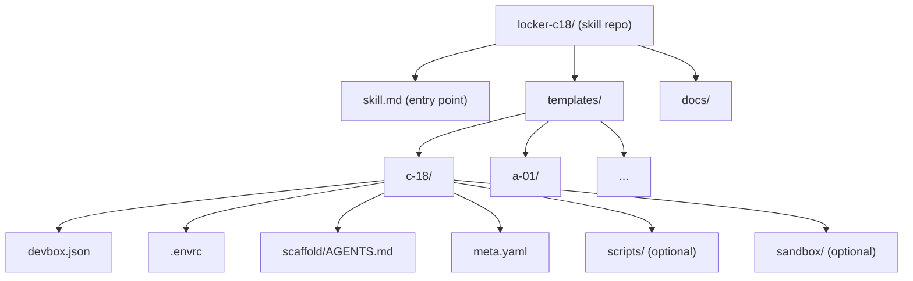
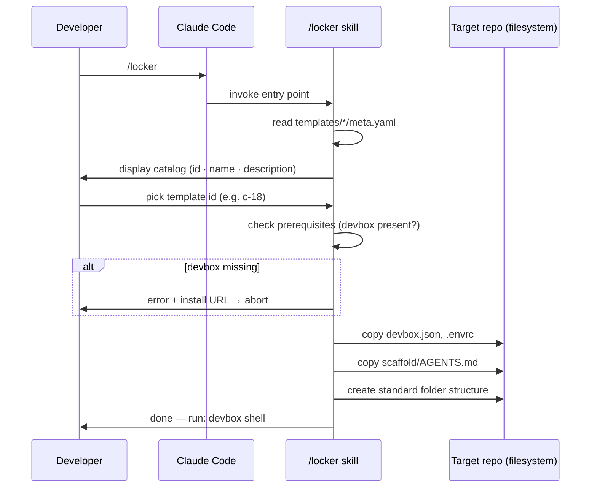

# Locker — Architecture Document

**Status**: Working draft — reflects new direction agreed with Paolo (2026-04-08).
**Supersedes**: BRIEFING.md (repo-da-clonare model, now obsolete).

---

## 1. Overview

**Locker** is a Claude Code skill that bootstraps AI-driven development environments from a curated template catalog.

### Usage model

```
# One-time install (developer machine)
claude skill install github:pablito/locker-c18

# In any empty repo
/locker
# → interactive catalog → pick template → repo is configured
```

The skill applies to the current directory: `devbox.json`, `.envrc`, `scaffold/AGENTS.md`, and the required folder structure. The developer gets a reproducible, agent-ready environment without manual configuration.

### Prerequisites (user responsibility)

- Claude Code (already present by assumption — they're using it to run the skill)
- devbox — must be installed before invoking `/locker`. The skill checks and fails fast with a clear installation link.
- direnv — installed and hooked into the user's shell. The skill can handle this (apt/brew/nix fallback chain) or delegate to the user.

Auto-installing devbox is explicitly out of scope (see ADR-03).

### Target platforms

Linux native and WSL2. No macOS support planned; not blocked, just untested.

---

## 2. Core Components

### 2.1 Skill entry point

A single file at the repo root consumed by Claude Code's skill loader. It defines:
- the slash command name (`/locker`)
- the invocation flow: display catalog → prompt for template ID → apply template

The entry point is intentionally thin. It orchestrates; it does not contain configuration data.

### 2.2 Template catalog

A structured directory under `templates/`. Each template is a self-contained subdirectory named with the `x-yy` format (see ADR-02).

Each template contains:
- `devbox.json` — packages, env vars, init hooks, devbox scripts
- `.envrc` — `use devbox` directive (and any template-specific env)
- `scaffold/AGENTS.md` — agent instructions for the bootstrapped repo
- `meta.yaml` — human-readable name, description, tags (used to build the catalog UI)
- Optionally: `scripts/`, `mcp/`, `sandbox/`, `pyproject.toml`, etc.

The catalog is built at runtime by reading all `templates/*/meta.yaml` files. No hardcoded list.

### 2.3 Scaffold per template

`scaffold/AGENTS.md` is the primary artifact deployed into the user's repo. It is the agent's operating manual for the bootstrapped environment: memory conventions, issue tracking, available CLIs, non-interactive shell rules.

The current `scaffold/AGENTS.md` in this repo serves as the canonical reference; each template may extend or restrict it.

---

## 3. Diagrams

### Repo structure



### Usage flow



---

## 4. Architectural Decisions

### ADR-01 — Skill vs CLI binary

**Decision**: Claude Code skill, not an npm/pip package or standalone binary.

**Rationale**: The target developer already has Claude Code. A skill requires zero additional installs and lives entirely within the workflow they're already in. A binary (e.g., `npx locker init`) would require Node on the host, a separate install step, and ongoing distribution maintenance. The tradeoff is that the skill only works inside Claude Code — but that's exactly the target audience.

**Rejected alternative**: npm package (`npx locker-c18 init`). Was listed as a future option in the original BRIEFING.md. Rejected because it adds complexity with no benefit for the current user profile.

### ADR-02 — Template naming: x-yy format

**Decision**: Templates are named with a single letter + two digits (e.g., `c-18`, `a-01`). The letter has no semantic meaning.

**Rationale**: Inspired by the locker numbering at Grand Central in Men in Black II — arbitrary IDs that carry no implied hierarchy or category. Semantic prefixes (e.g., `py-` for Python, `node-` for Node) would suggest a taxonomy that doesn't exist and would create false constraints on template scope. Arbitrary IDs are honest about what they are: opaque handles for self-describing units.

**Documented as intentional**: `meta.yaml` carries all human-readable metadata. The ID is not the documentation.

### ADR-03 — Devbox not auto-installed by the skill

**Decision**: The skill fails fast with a clear error and link if devbox is not present. It does not attempt to install devbox.

**Rationale**: Devbox installation requires running a script from the internet with elevated implications (modifies PATH, shell rc files, potentially uses sudo). This is a trust boundary the skill should not cross silently. The original `setup.sh` already made this call explicitly. Consistent with the existing policy of not doing `curl | bash` for devbox.

**Future option** (tracked as issue locker-c18-8d6, deferred P4): auto-install devbox in a Fase 2 if demand justifies it, with explicit user confirmation.

### ADR-04 — Single entry point, catalog built at runtime

**Decision**: No hardcoded template list in the entry point. The catalog is discovered from `templates/*/meta.yaml`.

**Rationale**: Adding a new template should require only dropping a new directory. Zero changes to the entry point or any index file. Discovery over registration.

---

## 5. Proposed Folder Structure

```
locker-c18/
├── skill.md                    # Claude Code skill entry point (defines /locker)
├── templates/
│   └── c-18/                   # First template (current devbox.json config)
│       ├── meta.yaml           # name, description, tags
│       ├── devbox.json
│       ├── .envrc
│       ├── scaffold/
│       │   └── AGENTS.md
│       ├── scripts/            # optional — copied if present
│       │   ├── setup.sh
│       │   ├── reset.sh
│       │   ├── sandbox.sh
│       │   ├── _dotnet.sh
│       │   └── _mcp.sh
│       ├── sandbox/            # optional
│       │   ├── Dockerfile
│       │   └── compose.yml
│       └── mcp/                # optional
│           └── config.json
├── docs/
│   └── architecture.md         # this file
├── AGENTS.md                   # instructions for agents working on the skill repo itself
└── README.md
```

**Files at repo root that are NOT deployed to the user**: `AGENTS.md`, `README.md`, `docs/`. These belong to the skill repo's own development workflow, not to any template.

**Files preserved from current repo but relocated**: `devbox.json`, `scripts/`, `sandbox/`, `mcp/`, `scaffold/AGENTS.md` all move into `templates/c-18/`. The root of the skill repo no longer contains environment configuration.

---

## 6. Open Issues

| ID | Priority | Topic |
|----|----------|-------|
| locker-c18-858 | P1 | Ridefinire architettura (questo documento la risolve in parte) |
| locker-c18-mzt | P1 | Definire entry point skill e flusso interattivo |
| locker-c18-n5i | P1 | Definire struttura cartelle template |
| locker-c18-ak6 | P2 | Documentare naming convention (vedi ADR-02) |
| locker-c18-8d6 | P4 | [Fase 2] Auto-installazione devbox |
